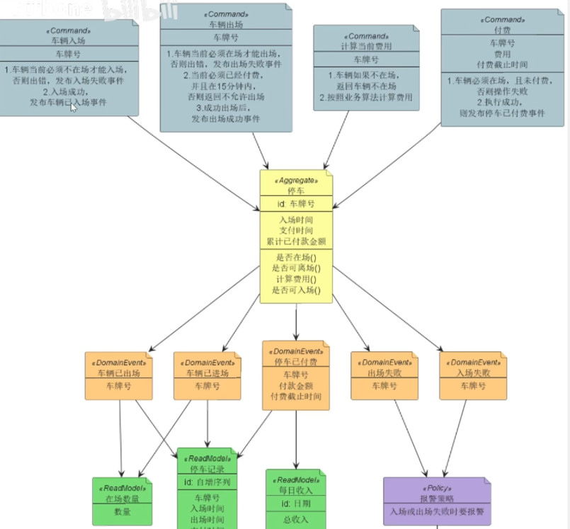

# step_ddd

# 源项目地址
https://github.com/ByteBlizzard/sample-ddd-parking/tree/domain

# 需求
```text
1. 做一个停车计费程序
2. 车牌识别系统会在车辆入场和出场的时候调用计费程序付费后15分钟内可以离场，超过15分钟要补费·
3. 车辆入场出场失败的时候，要给管理员报警·
4. 计费程序提供查询当前某个车牌号应付款·
5. 支付系统通知计费程序车辆已付款·
6. 用户要能够查看某个车牌号过去的停车记录·
7. 管理员要查看在场车辆总数,每日营业额
8. 计费规则是每小时1块，不足一小时当成1小时
```
# 需求分析
